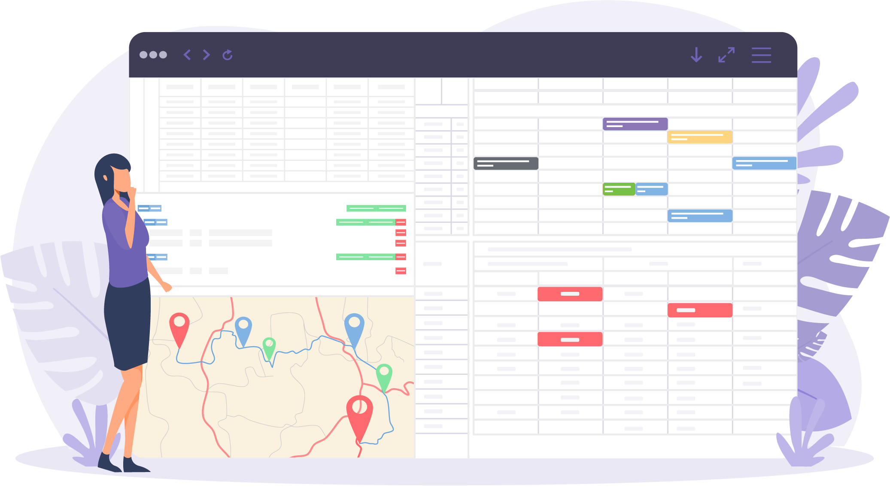

### Hi there 👋

I am managing partner at Dimenics, an ISV that builds software for the Microsoft Dynamics product suite. Formerly worked as a business consultant and software architect, where I specialized in the development of web-based business applications on top of Microsoft's technology stack. 

I spend most of my days working on [Dime.Scheduler](https://www.dimescheduler.com), a horizontal add-in for ERP systems such as Microsoft Dynamics 365 Business Central 🖥️.

Born and raised in  but now living abroad somewhere on the planet 🌎.

I occassionally write a post on my [blog](https://hendrikbulens.com) ✍️.

### Get in touch
  
 

